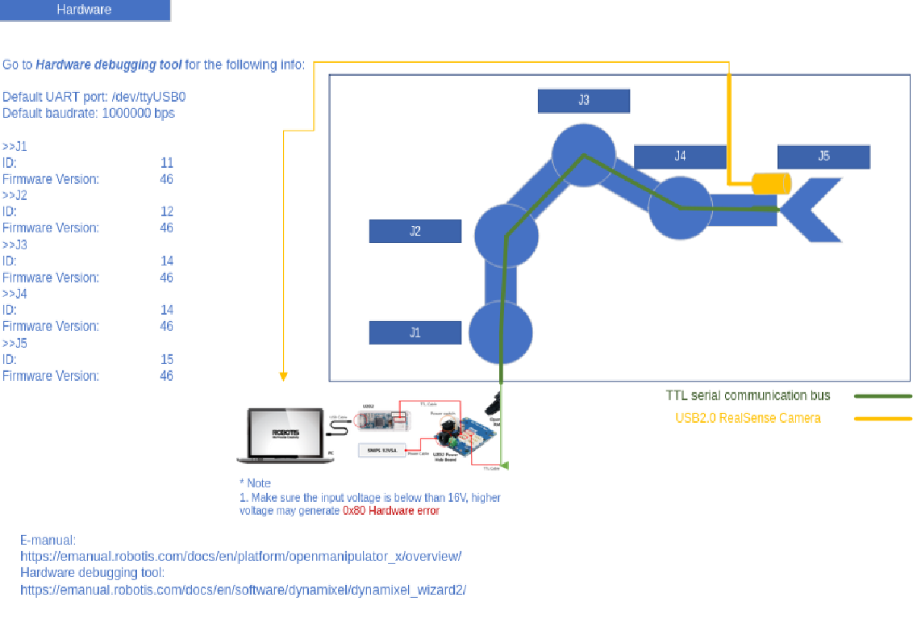
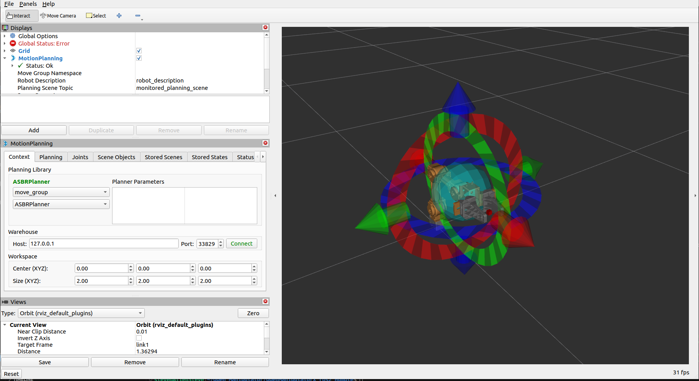
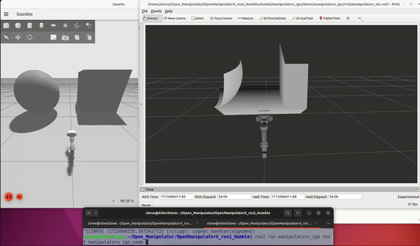

Open_Manipulator_X
=====

.. _Environment:

Environment
------------

This project was developed with the following environment and platform:
 * Ubuntu              22.04
 * ROS2                humble
 * ignition gazebo     6.16.0
 * ignition service    11.4.1
 * python              3.10.12
 * openmanipulatorx    `emanual <https://emanual.robotis.com/docs/en/platform/openmanipulator_x/overview/>`_
 * Intel Realsense     D435

.. _Hardware:

Hardware
------------

.. _installation:

Installation
------------

To use open manipulator x, first install relevant libraries by:

.. code-block:: bash

   $ sudo apt install ros-humble-moveit*
   $ sudo apt-get install ros-humble-control*
   $ sudo apt-get install ros-humble-ros2-control*
   $ sudo apt-get install ros-humble-ros-ign
   $ sudo apt-get install ros-humble-ign-ros2-control
   $ sudo apt-get install ros-humble-kinematics-interface-kdl
   $ sudo apt-get install ros-humble-rqt-joint-trajectory-controller
   $ sudo apt-get install python3-colcon*
   $ sudo apt-get install ros-humble-ur-moveit-config

Then goto the directory containing src folder and run rosdep 

.. code-block:: bash
   
   $ rosdep install --from-paths src --ignore-src -r -y

| Then change the specific directory of ``mx_controllers.yaml`` on your computer for the two files in package ``manipulatorx_ign``

* manipulator_camera.urdf.xacro

.. code-block:: bash
   
   Line22  <parameters>[your full directory]/mx_controllers.yaml</parameters>

* manipulator_camera.urdf

.. code-block:: bash
   
   Line350  <parameters>[your full directory]/mx_controllers.yaml</parameters>

| And one file in package ``manipulatorx_moveit``

* open_manipulator_x.urdf.xacro

.. code-block:: bash
   
   Line18  <parameters>[your full directory]/mx_controllers.yaml</parameters>

.. _Open_Manipulator_X status:

Open_Manipulator_X status
----------------

.. code-block:: bash
   
   $ source install/setup.bash
   # start the controller for the arm
   $ ros2 launch open_manipulator_x_controller open_manipulator_x_controller.launch.py 
   $ ros2 run arm_subscriber test_armsubcriber 
   # view the kinematic pose, joint positions and arm status

.. _Open_Manipulator_X service:

Open_Manipulator_X service
----------------

.. code-block:: bash
   
   $ source install/setup.bash
   # start the controller for the arm
   $ ros2 launch open_manipulator_x_controller open_manipulator_x_controller.launch.py 
   # use the tele-op to control the joint positions
   $ ros2 run arm_service test_movejoint
   # <------------or---------------> 
   # use the tele-op to control the gripper open or close
   $ ros2 run arm_service test_movetool 
   # <------------or---------------> 
   # use the tele-op to control the move in x y or z in cartesian space
   $ ros2 run arm_service test_movecart
   # <------------or---------------> 
   # run a pick-n-place program in fixed positions
   $ ros2 run arm_service test_pnp

.. _Open_Manipulator_X moveit:

Open_Manipulator_X moveit
----------------

.. code-block:: bash

   $ source install/setup.bash
   # launch the moveit package
   $ ros2 launch manipulatorx_moveit manipulator_moveit.launch.py

| The moveit package demostrate the trajectory planning with several famous algorithm like PRM, RRT etc
|
| you can test your own planning algorithm by switch to custom planning pipeline ``manipulator_moveit.launch.py``: 
|

.. code-block:: bash

   $ >>> Planning Configuration
   # planning_pipeline_config = {
   #     "move_group": {
   #         "planning_plugin": "ompl_interface/OMPLPlanner",
   #         "request_adapters": """default_planner_request_adapters/AddTimeOptimalParameterization default_planner_request_adapters/FixWorkspaceBounds default_planner_request_adapters/FixStartStateBounds default_planner_request_adapters/FixStartStateCollision default_planner_request_adapters/FixStartStatePathConstraints""",
   #         "start_state_max_bounds_error": 0.1,
   #     }
   # }
   # ompl_planning_yaml = load_yaml("manipulatorx_moveit", "config/ompl_planning.yaml")
   # planning_pipeline_config["move_group"].update(ompl_planning_yaml)
   
   $ >>> custom planning configuration
   planning_pipeline_config = {
     "move_group": {
         "planning_plugin": "manipulatorx_moveit/ASBRPlanner",
         "start_state_max_bounds_error": 0.1,
      }
   }
   asbr_planning_yaml = load_yaml("manipulatorx_moveit", "config/custom_planning.yaml")
   planning_pipeline_config["move_group"].update(asbr_planning_yaml)

|

.. _Open_Manipulator_X gazebo:

Open_Manipulator_X gazebo
----------------

.. code-block:: bash

   $ source install/setup.bash
   # launch the moveit package
   $ ros2 launch manipulatorx_ign manipulatorx_ign.launch.py
   # you can run the node to see the arm move and view changes
   $ ros2 run manipulatorx_ign test_manipulatorx_ign_node 

.. _Open_Manipulator_X ArUco:

Open_Manipulator_X ArUco
----------------

.. code-block:: bash

   $ source install/setup.bash
   # launch the pick aruco package
   $ ros2 launch manipulatorx_handeye manipulatorx_handeye.launch.py
   # you can run the node to see the arm move and pick up the aruco object in workspace automatically
   $ ros2 run manipulatorx_handeye search_aruco

.. image:: images/grasp_aruco_gif.gif
   :height: 450px
   :width: 800px
   :alt: grasp_aruco_gif

| The handeye calibration matrix is written into urdf, can be retrieved from:

.. code-block:: bash

   $ ros2 run tf2_ros tf2_echo camera_color_optiocal_frame end_effector_link
